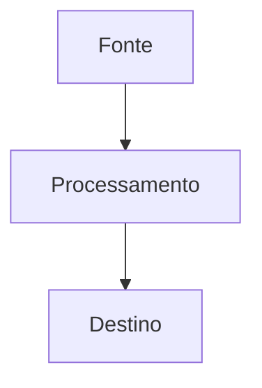

# Brain V4 Colli — Padroes de Documentacao
**Status:** v1 — Fundamento
**Atualizado:** 2026-04-15
**Fonte:** humano

---

## Proposito deste arquivo

Define COMO este cerebro deve ser lido, escrito e mantido — tanto por humanos quanto por agentes de IA.
Todo agente que acessa este repositorio deve ler este arquivo antes de qualquer edicao.

---

## Hierarquia de conhecimento (paths canonicos)

> **Nota historica:** documentacao antiga referia `docs/` e `streams/`. Neste repositorio os paths reais sao os abaixo.

```
CLAUDE.md / AGENTS.md          ← indice (<100 linhas, aponta para empresa/contexto/)
 │
  ├── empresa/contexto/        ← conhecimento ESTAVEL da empresa (muda em meses)
 │   ├── 00-DOC-STANDARDS.md       (este arquivo)
  │   ├── 01-COMPANY.md
  │   ├── 02-PRODUCTS.md
  │   ├── 03-TEAM.md
  │   ├── 04-TECHNOLOGY.md
  │   ├── 05-VOCABULARY.md
  │   ├── 06-AGENT-PROTOCOLS.md
  │   └── 07-CONTEXT-SECURITY.md   ← escopo, diretorios sensiveis, commits
  │
  ├── projetos/                ← clientes em operacao (vivo — muda em dias)
  │   └── <slug-cliente>.md
  │
  ├── areas/                   ← areas funcionais (operacional — muda em semanas)
  │   ├── <area>/estado-atual.md
  │   ├── <area>/metricas.md
  │   └── <area>/playbooks/
  │
  ├── empresa/produtos/        ← fichas completas (~90) — mantidas por humanos
  │
  └── areas/tecnologia/referencias/  ← decisoes e diagramas (fonte humana)
```

Material complementar **fora** de `brain_v4_colli/` (ex.: outros diretorios no monorepo) so conta como fonte se o humano apontar explicitamente; nao e parte deste cerebro.

---

## Separacao por estabilidade

| Camada | Conteudo | Frequencia de mudanca | Onde vive |
|--------|----------|----------------------|-----------|
| **Fundamentos** | Empresa, produtos, equipe, stack, vocabulario | Raro (meses) | `empresa/contexto/01-*` a `05-*` |
| **Decisoes e ADRs** | Escolhas tecnicas, hipoteses ativas | Frequente (semanas) | `empresa/contexto/06-AGENT-PROTOCOLS.md` |
| **Seguranca de contexto** | Escopo de edicao, commits, diretorios de risco | Quando politica mudar | `empresa/contexto/07-CONTEXT-SECURITY.md` |
| **Operacao — cliente** | Context card de cliente ativo | Muito frequente (dias) | `projetos/` |
| **Operacao — area** | Estado atual, KPIs, playbooks | Frequente (semanas) | `areas/<area>/` |
| **Fontes primarias** | Fichas de produto completas | Mantidas por humanos | `empresa/produtos/` |

> Regra: se um "fundamento" muda toda semana, e hipotese operacional — trate em `areas/` ou `projetos/`, nao em `01-` a `05-` sem revisao.

---

## O que documentar

- Decisoes de arquitetura e motivos — **por que** escolhemos um caminho
- Estruturas de dados e relacionamentos — como a informacao e organizada
- Vocabulario canonico — termos que o agente deve usar
- Contexto operacional vivo — clientes (`projetos/`), areas (`areas/`)
- Protocolos de agente — regras de como ler e escrever neste cerebro

## O que NAO documentar

- Walkthroughs de codigo — o codigo e diretamente legivel
- Contagens especificas que mudam toda hora — preferir `areas/<area>/metricas.md` ou contexto do cliente
- Conversas efemeras — somente o resultado final entra na doc
- Decisoes nao tomadas — registre como hipotese, nao como fato

---

## Formato padrao de arquivo

Todo arquivo neste cerebro deve ter:

```markdown
# Titulo do Documento
**Status:** [v1 | draft | revisado]
**Atualizado:** YYYY-MM-DD
**Fonte:** [humano | agente:<nome> | sistema:<nome>]

---

[conteudo]
```

Arquivos operacionais em `projetos/` ou `areas/*/estado-atual.md` devem incluir, quando aplicavel:

```markdown
**Proxima revisao:** YYYY-MM-DD
```

---

## Regras de precedencia (conflitos)

Quando informacoes conflitam, aplique esta hierarquia:

1. **ADR explicita** em `06-AGENT-PROTOCOLS.md` prevalece sobre qualquer outra fonte
2. **Dado mais recente** prevalece sobre dado mais antigo (exceto Fundamentos)
3. **Dado quantitativo** prevalece sobre percepcao qualitativa
4. **Contexto especifico** (`projetos/`, area) prevalece sobre contexto geral da empresa

### O que nunca fazer ao atualizar

- Nunca sobrescrever silenciosamente um fundamento em `empresa/contexto/01-` a `05-` — crie nota de revisao
- Nunca marcar hipotese como validada sem evidencia explicita e datada
- Nunca misturar afirmacoes de datas diferentes no mesmo paragrafo sem indicar qual e qual
- Nunca inferir que algo foi decidido se nao ha registro correspondente

---

## Nomeacao de arquivos

- `empresa/contexto/`: prefixo numerico `00-`, `01-`, `02-`... em ordem de leitura
- Formato: titulo legivel; preferir nomes sem acentos nos paths para compatibilidade com ferramentas
- Conteudo sempre em portugues (pt-BR)
- `projetos/`: `slug-cliente.md` (kebab-case)
- `areas/`: por convencao `estado-atual.md`, `metricas.md`, `MAPA.md`

---

## Diagrama (padrao Mermaid)

Use Mermaid para todos os diagramas de fluxo e arquitetura:



ASCII art para wireframes e layouts simples.

---

## Manutencao continua

| Frequencia | Tarefa |
|-----------|--------|
| A cada sessao de agente | Atualizar `projetos/` ou `areas/` quando houver contexto novo naquele escopo |
| Semanal | Revisar estado-atual e metricas com `Proxima revisao` vencida |
| Mensal | Revisar `empresa/contexto/01-` a `05-` — atualizar o que ficou defasado |
| Trimestral | Avaliar ADRs em `06-AGENT-PROTOCOLS.md` e regras em `07-CONTEXT-SECURITY.md` |
