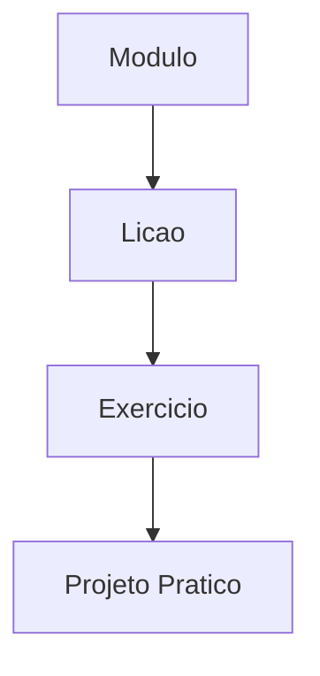

# Documentacao do Projeto — Vibe Coding Training
**Proposito**: Documentacao de design, arquitetura e decisoes para o projeto Vibe Coding Training
**Ultima Atualizacao:** 2026-04-13

---

## Padroes de Documentacao

### O Que Documentamos
- ✅ Decisoes de arquitetura e design — por que escolhemos um caminho
- ✅ Estruturas de dados e relacionamentos — como a informacao e organizada
- ✅ Padroes de UI/UX — as regras que governam layout, navegacao e interacao
- ✅ Padroes de integracao — bibliotecas, APIs e servicos de terceiros
- ✅ Contratos de API — formatos de request/response e assinaturas
- ✅ Vocabulario — termos canonicos e o que eles substituem
- ✅ Skills de IA — instrucoes operacionais reutilizaveis para agentes
- ✅ Guias de ensino — como cada modulo do treinamento deve ser apresentado

### O Que NAO Documentamos
- ❌ Codigo-fonte — os arquivos sao diretamente legiveis
- ❌ Detalhes de implementacao — walkthroughs passo-a-passo de codigo
- ❌ Dados volateis — contagens especificas que mudam frequentemente
- ❌ Rastreamento de progresso — pertence a `plans/`
- ❌ Conversas ou decisoes efemeras — pertencem ao Slack ou ao ChatGPT; somente o resultado final entra na doc

### Politica de Arquivos Temporarios

Todos os arquivos temporarios, artefatos de investigacao e trabalhos em andamento vao para `temp/` na raiz do projeto. O diretorio `temp/` e ignorado pelo git.

Onde arquivos permanentes pertencem:
- `docs/` — documentacao do projeto (PRD, specs, ADRs, guias, referencias)
- `docs/guides/` — Skills reutilizaveis (instrucoes operacionais para IA)
- `docs/prd/` — Product Requirements Documents
- `docs/specs/` — Especificacoes tecnicas
- `docs/adr/` — Architecture Decision Records
- `plans/` — planejamento e rastreamento de projeto
- `src/` — codigo de producao da aplicacao
- `scripts/` — scripts de automacao e build
- `.cursor/` — configuracoes do Cursor IDE

### Sistema de Tres Camadas de Documentacao

O projeto segue tres camadas de documentacao:

1. **Skills** (`docs/guides/`) — Instrucoes operacionais reutilizaveis. Sao ativadas automaticamente pela IA quando palavras-gatilho aparecem. Exemplo: "skill de identidade visual", "padrao de CRUD".

2. **Documentos Vivos** (`docs/prd/`, `docs/specs/`) — PRDs, especificacoes e historias de usuario que evoluem com o projeto. Representam o "o que" e o "por que" do produto.

3. **Decisoes** (`docs/adr/`) — Architecture Decision Records. Registram decisoes tomadas e seus motivos. Nunca sao deletadas; se uma decisao muda, um novo ADR e criado referenciando o anterior.

---

## Skill versus interface (produto)

Antes de desenhar telas em React ou abrir PR focado em UI, faca a pergunta de arquitetura: **este resultado precisa ser uma interface para humanos ou pode ser uma skill (playbook para agente)?**

### O que e cada coisa

- **Skill** — Instrucoes operacionais reutilizaveis para agentes: criterios, passos, exemplos do certo e do errado, governanca. Neste repo, o padrao e material em `docs/guides/`, `docs/templates/` e referencias em `docs/references/`, podendo ser empacotado em ferramentas (Claude, Cursor, etc.). O valor aparece quando **voce ou a equipe** executam o fluxo via chat com contexto carregado. Nao substitui sozinha um produto com login, permissoes ou escala para cliente final.

- **Interface** (`app/`) — Superficie para **usuarios humanos** no produto: telas, formularios, fluxos navegaveis. Indicada quando o usuario final precisa agir sem depender do chat, quando ha multiusuario, permissoes, persistencia compartilhada, SLA de disponibilidade, ou experiencia comercial obrigatoria.

### Perguntas de decisao (responda antes de codar UI)

1. Quem e o usuario primario: alguem **fora** do fluxo Cursor/Claude, ou a propria equipe guiada por agente?
2. O fluxo precisa existir **sem** ferramenta de IA aberta (ex.: cliente ou operador usando so o navegador)?
3. O entregavel e sobretudo **procedimento repetivel e auditavel** (tende a skill) ou **experiencia visual e interacao em produto** (tende a interface)?
4. Se voce descrever o problema em poucas linhas numa skill, o agente resolve a maior parte **sem** nova tela?
5. Uma nova tela adiciona manutencao permanente (layout, acessibilidade, deploy) — isso se paga para o alcance do projeto?

**Se a maioria aponta equipe + agente + repeticao**, nao comece por interface: crie ou atualize uma skill, valide o processo no chat, e registre em `docs/05-ARCHITECTURE-DECISIONS.md` se a escolha for deliberadamente *nao* investir em UI agora.

**Se aponta usuario final, self-service obrigatorio, ou canal que nao e chat**, interface e adequada; siga entao PRD, design system e ADRs como nas demais secoes deste documento.

### Erros comuns

- **Tela para o que e processo interno** — Formulario ou painel que so o agente deveria seguir; custo de UX e codigo sem usuario real.
- **Skill no lugar de produto** — Playbook solto quando o cliente ou o mercado precisam de aplicacao; falta de rastreio, permissoes e experiencia consistente.

Quando a escolha nao for obvia, registre-a como ADR ou hipotese em `docs/05-ARCHITECTURE-DECISIONS.md`.

---

## Nomeacao de Arquivos

- Prefixo `00-` para arquivos meta/index
- Numerados em ordem de leitura (`01-`, `02-`, `03-`)
- Formato `MAIUSCULAS-COM-HIFENS.md`
- Nomes em ingles para compatibilidade com ferramentas de IA
- Conteudo em portugues (pt-BR)

---

## Padroes de Diagrama

- Formato Mermaid para todos os diagramas
- Evitar aspas e parenteses em labels dentro de colchetes
- Nomes de entidades claros sem caracteres especiais
- Direcao consistente (top-to-bottom ou left-to-right)
- ASCII art para esbocos simples de layout (wireframes de sidebar, layouts de paineis)

Exemplo de diagrama Mermaid:

---

## Arquivos de Contexto para IA

Pontos de entrada na **raiz do repositorio** (ver detalhes e pastas `.claude/`, `.cursor/`, `.agents/` em **`docs/08-AI-TOOL-CONFIG.md`**):

- **`AGENTS.md`** — Convencao portatil (OpenAI Codex, Cursor Agent, outras ferramentas que leem o mesmo nome). Markdown livre na raiz; nao confundir com `AGENT.md`.

- **`CLAUDE.md`** — Instrucoes carregadas pelo **Claude Code** por sessao. Deve permanecer **alinhado** ao `AGENTS.md` no que diz respeito a stack, comandos e links de documentacao. Preferencias locais opcionais: `CLAUDE.local.md` (gitignored).

- **`app/CLAUDE.md`** — Escopo **apenas** do app React; aponta para os arquivos da raiz.

Principio: indice e links para `docs/`, nao enciclopedia no arquivo de contexto.

---

## Manutencao da Documentacao

### Quando Atualizar
- Adicao de features importantes — atualizar arquivos relevantes
- Mudancas de arquitetura — atualizar o arquivo de IA ou ADR
- Novas integracoes — adicionar doc de integracao ou atualizar o design system
- Mudancas no modelo de dados — atualizar o arquivo de data architecture
- Mudancas de vocabulario — atualizar o arquivo de vocabulario
- Novos modulos de treinamento — atualizar a information architecture

### Diretrizes de Contribuicao
1. Mantenha equilibrio — contexto suficiente, sem detalhes excessivos
2. Use diagramas — Mermaid ou ASCII para relacionamentos complexos
3. Referencia cruzada — linke para docs relacionados
4. Date atualizacoes — atualize "Ultima Atualizacao" em cada mudanca
5. Seja preciso — evite declaracoes vagas
6. Escreva para agentes — documentacao deve ser legivel por IA e humanos
7. Tudo no repositorio — nenhuma decisao deve existir apenas no Slack, Google Docs ou na cabeca de alguem

---

## Separacao por Estabilidade

Nem toda documentacao muda na mesma velocidade. Separar por estabilidade evita que informacao estavel seja contaminada por dados operacionais volateis.

| Camada | Conteudo | Frequencia de mudanca | Onde vive |
|--------|----------|----------------------|-----------|
| **Fundamentos** | Proposito, stack, design system, principios de arquitetura | Raro (meses) | `docs/00-*` a `docs/04-*` |
| **Decisoes e Hipoteses** | ADRs, hypothesis tracker, escolhas tecnicas ativas | Frequente (semanas) | `docs/05-ARCHITECTURE-DECISIONS.md` |
| **Operacao** | Proximos passos, sprints, tarefas, backlog | Muito frequente (dias) | `plans/` |

> Regra: se um "fundamento" esta mudando toda semana, provavelmente e uma hipotese, nao um fundamento. Mova para o Hypothesis Tracker.

---

## Regras de Precedencia para Atualizacao por Agentes

Quando um agente de IA (ou humano) atualiza a documentacao e encontra informacoes conflitantes, aplique esta hierarquia:

1. **Decisao explicita (ADR)** prevalece sobre inferencia ou comentario informal
2. **Input mais recente** prevalece sobre input mais antigo — exceto quando o mais antigo e um Fundamento (nao sujeito a revisao operacional)
3. **Dado quantitativo** prevalece sobre percepcao qualitativa
4. **Contexto especifico** prevalece sobre contexto geral (ex: regra de RLS para tabela X prevalece sobre regra generica de seguranca)

### O que nunca fazer ao atualizar docs
- Nunca sobrescrever silenciosamente uma ADR ativa com informacao nova — crie uma nova ADR e marque a anterior como REVISADA
- Nunca marcar uma hipotese como validada sem evidencia explicita
- Nunca misturar afirmacoes de datas diferentes no mesmo paragrafo sem indicar qual e qual
- Nunca inferir que algo foi decidido se nao ha ADR correspondente — registre como hipotese ou questao em aberto
