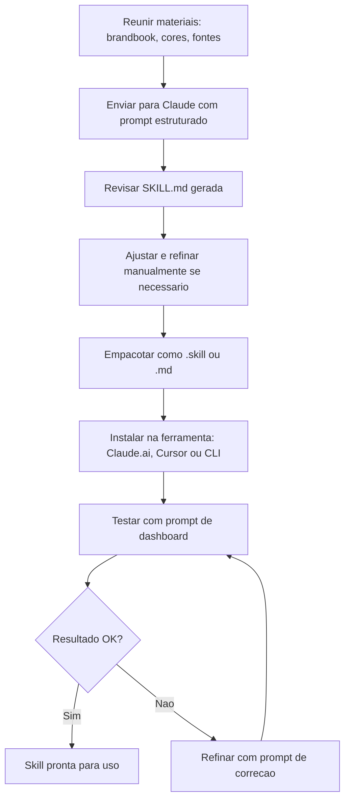

# Vibe Coding Training — Skill de Identidade Visual
**Status:** v1
**Ultima Atualizacao:** 2026-04-11

---

## O Que E uma Skill de Identidade Visual

Uma Skill de Identidade Visual e um arquivo de instrucoes operacionais que ensina a IA a gerar codigo que respeita a identidade visual de um projeto. Quando instalada, a skill e ativada automaticamente sempre que o agente detecta palavras-gatilho como "crie um componente", "dashboard", "tela de login" ou "formulario".

Sem a skill, a IA gera componentes com cores genericas, fontes padrao e espacamento arbitrario. Com a skill, todo codigo gerado ja sai alinhado com a marca — cores corretas, tipografia definida, espacamento consistente e padroes visuais do projeto.

---

## Passo 1: Reunir Materiais

Antes de criar a skill, reuna todos os materiais de identidade visual disponiveis:

### Materiais Necessarios

| Material | Formato | Prioridade |
|----------|---------|------------|
| Brandbook / Manual de marca | PDF | Alta |
| Apresentacao institucional | PPTX / PDF | Media |
| Codigos de cor (HEX) | Texto / Figma | Alta |
| Fontes da marca | Arquivos de fonte ou nomes | Alta |
| Exemplos de telas existentes | Screenshots / Figma | Alta |
| Icones e ilustracoes | SVG / PNG | Media |
| Guia de tom de voz (se houver) | PDF / Doc | Baixa |

### Fontes de Tokens

Se o projeto usa Figma como fonte de verdade do design:

1. Exporte tokens do Figma usando o plugin **Tokens Studio** (antigo Figma Tokens)
2. Converta para JSON usando **Style Dictionary**
3. O JSON resultante contem: cores, tipografia, espacamento, sombras, bordas, breakpoints, animacoes

Se nao ha Figma, extraia manualmente:
- Cores: use um color picker nas telas existentes, brandbook ou PDF
- Fontes: identifique nos materiais ou pergunte ao designer
- Espacamento: meça nos screenshots ou defina uma escala base (4px, 8px, 12px, 16px, 24px, 32px, 48px, 64px)

---

## Passo 2: Gerar a Skill com Prompt Estruturado

Use o Claude para analisar os materiais e gerar o arquivo SKILL.md. Envie o seguinte prompt junto com os materiais visuais:

### Prompt de Geracao

```
Analise os materiais de identidade visual que enviei (brandbook, apresentacao, 
screenshots) e gere um arquivo SKILL.md completo para uso como Skill no Claude.

O arquivo deve conter as seguintes secoes:

## 1. Filosofia de Design
Descreva em 3-5 frases o espirito visual da marca. Que sensacao deve transmitir? 
Que palavras-chave definem a estetica? (ex: "moderno e acolhedor", "corporativo 
mas acessivel", "minimalista com toques de cor")

## 2. Paleta de Cores
Liste TODAS as cores como CSS custom properties, organizadas em:
- Cores primarias da marca
- Cores secundarias / de acento
- Cores de status (sucesso, erro, aviso, info)
- Cores de superficie (backgrounds, cards, bordas)
- Variantes dark mode (se aplicavel)

Formato:
--nome-da-cor: #HEXCODE; /* uso: descricao */

## 3. Tipografia
Defina a escala tipografica completa:
- Fonte primaria (headings)
- Fonte secundaria (body, se diferente)
- Fonte monoesacada (codigo)
- Escala: display, h1, h2, h3, body, small, label, code
- Pesos usados: light, regular, medium, semibold, bold
- Line-height para cada escala

## 4. Espacamento e Layout
- Grid base (4px? 8px?)
- Espacamento entre secoes
- Padding de containers
- Largura maxima de conteudo
- Breakpoints responsivos
- Comportamento da sidebar (se houver)

## 5. Componentes (JSX/HTML)
Para cada componente principal, forneça um exemplo de codigo com as classes 
Tailwind corretas:
- Botao primario, secundario, ghost, destrutivo
- Card padrao
- Input de formulario
- Badge / tag de status
- Header de pagina
- Item de navegacao (ativo e inativo)

## 6. Anti-Padroes
Liste o que NUNCA fazer:
- Cores proibidas
- Fontes proibidas
- Padroes visuais a evitar
- Erros comuns

## 7. Checklist de Qualidade
Lista de verificacao para validar se um componente gerado esta alinhado com 
a identidade visual.
```

### Exemplo de Saida (trecho)

```markdown
## Filosofia de Design
A marca transmite modernidade acessivel — tecnologia avancada apresentada de 
forma acolhedora. Visual limpo com toques de cor roxa vibrante. Espacamento 
generoso que permite o conteudo respirar. A interface deve parecer um produto 
premium sem ser intimidadora.

## Paleta de Cores
```css
:root {
  /* Primarias */
  --primary: #6D28D9;           /* botoes, links, destaques */
  --primary-hover: #5B21B6;     /* hover em elementos primarios */
  --primary-light: #F3E8FF;     /* backgrounds sutis */
  
  /* Neutras */
  --background: #FAFAFA;        /* fundo da pagina */
  --surface: #FFFFFF;           /* cards, modais */
  --border: #E2E8F0;            /* bordas de containers */
  --text-primary: #0F172A;      /* texto principal */
  --text-secondary: #64748B;    /* texto secundario, metadata */
  
  /* Status */
  --success: #10B981;           /* conclusao, progresso */
  --error: #EF4444;             /* erros, acoes destrutivas */
  --warning: #F59E0B;           /* avisos */
  --info: #3B82F6;              /* informacoes */
}
```
```

---

## Passo 3: Empacotar e Instalar a Skill

### Formato do Arquivo .skill

O arquivo deve ser salvo com extensao `.skill` ou como `.md` em `docs/guides/`. A estrutura e:

```
---
nome: Identidade Visual — [Nome do Projeto]
descricao: >
  Aplica a identidade visual do [Projeto] em todo codigo gerado.
  Ativado automaticamente ao criar componentes, telas, dashboards,
  formularios, layouts ou qualquer elemento visual.
gatilhos:
  - componente
  - tela
  - dashboard
  - formulario
  - layout
  - pagina
  - botao
  - card
  - design
  - visual
  - UI
  - interface
versao: 1.0
---

[Conteudo completo da skill gerado no Passo 2]
```

### Instalacao

**No Claude.ai (web):**
1. Acesse Configuracoes → Skills (ou Projects → Project Knowledge)
2. Clique em "Adicionar Skill" ou "Upload"
3. Envie o arquivo `.skill`
4. Verifique que a descricao e os gatilhos estao corretos

**No Cursor IDE:**
1. Coloque o arquivo em `docs/guides/SKILL-IDENTIDADE-VISUAL.md`
2. Referencie no CLAUDE.md: `Antes de gerar componentes visuais, leia docs/guides/SKILL-IDENTIDADE-VISUAL.md`
3. O Cursor incluira automaticamente o contexto relevante

**No Claude Code (CLI):**
1. Coloque o arquivo em `docs/guides/`
2. Adicione referencia no CLAUDE.md na raiz do projeto
3. O agente carregara automaticamente ao trabalhar com componentes visuais

### Descricao da Skill — Palavras-Gatilho

A descricao da skill e critica porque determina quando o Claude a ativa automaticamente. Inclua palavras-gatilho relevantes:

```
Aplica a identidade visual do Vibe Coding Training em todo codigo 
gerado. Use sempre que criar: componentes React, telas, dashboards, 
formularios, paginas, layouts, botoes, cards, tabelas, modais, 
sidebars ou qualquer elemento de interface (UI). Garante cores, 
tipografia, espacamento e padroes visuais consistentes com a marca.
```

---

## Passo 4: Testar e Validar

### Prompt de Teste

Envie o seguinte prompt para verificar se a skill esta funcionando:

```
Crie um dashboard de visao geral com:
- Header com titulo "Meu Progresso" e subtitulo
- Grid de 3 cards com metricas (licoes completas, tempo investido, nivel atual)
- Lista das ultimas atividades
- Barra de progresso geral

Use React + TypeScript + Tailwind CSS + shadcn/ui.
```

### Checklist de Validacao

Apos receber o codigo gerado, verifique:

- [ ] **Cores**: As cores primarias e secundarias da marca estao corretas?
- [ ] **Tipografia**: A fonte especificada esta sendo usada? Os tamanhos seguem a escala definida?
- [ ] **Espacamento**: O espacamento e consistente e segue a grid base?
- [ ] **Hierarquia visual**: Titulos, subtitulos e corpo tem pesos e tamanhos corretos?
- [ ] **Componentes**: Botoes, cards e inputs seguem o padrao definido na skill?
- [ ] **Dark mode**: As variantes dark mode estao implementadas?
- [ ] **Anti-padroes**: Nenhum dos anti-padroes listados foi usado?
- [ ] **Responsividade**: O layout se adapta aos breakpoints definidos?

### Prompt de Refinamento

Se a saida nao estiver alinhada, use este prompt para corrigir:

```
O componente gerado tem os seguintes problemas de identidade visual:

1. [Descreva o problema — ex: "as cores de fundo estao usando cinza 
   generico em vez de --background: #FAFAFA"]
2. [Descreva outro problema]

Corrija o componente respeitando a Skill de Identidade Visual. 
Especificamente:
- Use as CSS custom properties definidas na skill, nao valores hardcoded
- Siga a escala tipografica exata (display: 36px, h1: 30px, etc.)
- Use os componentes shadcn/ui com as variantes customizadas do projeto
```

---

## Fluxo Completo Resumido



---

## Manutencao da Skill

- **Atualize quando a marca mudar** — novas cores, fontes ou componentes devem ser refletidos na skill
- **Versione a skill** — use o campo `versao` no header para rastrear mudancas
- **Documente mudancas** — adicione um changelog no final do arquivo
- **Teste periodicamente** — gere um componente novo a cada major update para validar
- **Compartilhe com o time** — a skill deve estar no repositorio, nao na conta pessoal de alguem

---

## Dicas Avancadas

### Skill Composta (Multi-Tema)

Para projetos com temas (light + dark + alto contraste), crie secoes separadas na skill:

```markdown
## Tema Claro
[tokens e exemplos para light mode]

## Tema Escuro
[tokens e exemplos para dark mode]

## Alto Contraste
[tokens e exemplos para acessibilidade]
```

### Skill com Exemplos de Composicao

Inclua exemplos de composicoes comuns (nao apenas componentes atomicos):

```markdown
## Composicoes
### Card com Header e Acoes
[codigo completo de um card tipico do projeto]

### Formulario de Criacao
[codigo completo de um formulario tipico]

### Pagina com Sidebar + Conteudo
[codigo completo do layout mais comum]
```

### Integracao com Style Dictionary

Se o projeto usa Figma → Style Dictionary → JSON:

1. Exporte tokens do Figma como JSON
2. Coloque em `src/tokens/design-tokens.json`
3. Na skill, referencie: "Os tokens de design estao em `src/tokens/design-tokens.json`. Use esses valores como fonte de verdade."
4. O agente carregara o JSON e usara os valores exatos
