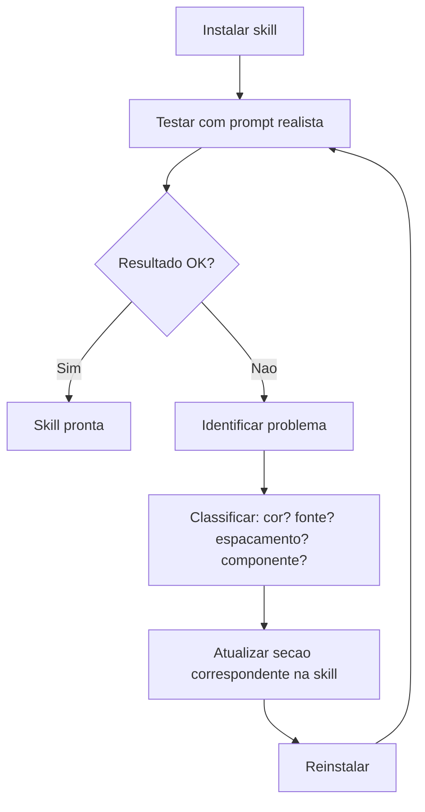

# Guia Completo de Criacao de Skills para IA
**Proposito**: Ensinar como criar, instalar e manter Skills reutilizaveis para agentes de IA (Claude, Cursor, etc.)
**Ultima Atualizacao:** 2026-04-13

> **Documentos relacionados:**
> - `docs/06-SKILL-IDENTIDADE-VISUAL.md` — Skill de referencia de identidade visual do projeto
> - `docs/references/SKILL-EXAMPLES.md` — Exemplos concretos de skills prontas
> - `docs/templates/SKILL-TEMPLATE.md` — Template em branco para criar sua skill
> - `docs/templates/PROMPT-CREATE-SKILL.md` — Prompts estruturados para gerar skills com o Claude
> - `*/skills/sabatina-prd/` — Sabatina estruturada (espelhado em `.claude`, `.cursor`, `.agents`, `.codex`)
> - `*/skills/relatorio-deck-html/` — Exemplo semi-deterministico (HTML + JSON + script)

---

## Como derivar uma skill (alem do metodo classico)

Alem de “reunir materiais e pedir para a IA gerar” (fluxo abaixo), duas origens comuns neste starter sao a **sabatina** e a **leitura de entregas ja feitas**. Em ambos os casos o objetivo e transformar **informacao ja estruturada ou semi-estruturada** em **instrucoes operacionais** que o agente repete com consistencia.

### Origem 1: A partir de uma sabatina

**Quando usar:** voce ainda nao tem skill escrita, mas ja conduz (ou vai conduzir) uma conversa de esclarecimento com perguntas e respostas — antes de codar ou antes de consolidar um PRD.

**Passos:**

1. Execute a skill **`sabatina-prd`** em `*/skills/` (ou equivalente) ate obter um **PRD** ou conjunto de decisoes claras.
2. **Extraia invariantes** — o que deve valer em toda sessao futura, nao so neste projeto:
   - criterios de aceitacao que se repetem;
   - “nunca fazer X” que apareceu na conversa;
   - formato de saida desejado (checklist, secoes obrigatorias, tom).
3. **Separe** o que e **contexto do projeto** (vai para `docs/` ou PRD) do que e **procedimento do agente** (vai para a skill).
4. Monte o `SKILL.md` com:
   - `description` rica em **palavras-gatilho** que lembrem o dominio (ex.: “apos sabatina”, “PRD”, “deck”, “relatorio”).
   - secao **Fluxo obrigatorio** espelhando a ordem da sabatina que funcionou.
   - **Anti-padroes** tirados das correcoes que o usuario fez durante a conversa.
5. Se a sabatina produzir **dados estruturados** (titulos, bullets, decisao skill vs UI), considere um **segundo artefato** gerado por script — ver skill exemplo **`relatorio-deck-html`** (template + `fill-deck.mjs` **dentro da pasta da skill** + JSON).

**Armadilha:** copiar o PRD inteiro para dentro da skill. Isso **infla** a skill e mistura “o que” (produto) com “como o agente deve proceder”. Skill deve ficar **enxuta**; detalhe de produto permanece em `plans/` ou `docs/`.

### Origem 2: A partir de leitura de entregas ja feitas

**Quando usar:** existe codigo, PRDs, ADRs, issues ou documentos que ja refletem um padrao maduro; voce quer **codificar** esse padrao para o agente nao reinventar.

**Fontes tipicas:**

| Fonte | O que extrair para a skill |
|-------|----------------------------|
| `plans/in-progress/*.md` | Escopo, definicoes, criterios que devem se repetir |
| `docs/05-ARCHITECTURE-DECISIONS.md` | Decisoes ativas, formatos de ADR, hipoteses |
| `docs/prd/`, `docs/specs/` | Regras de dominio estaveis (nao copiar o doc todo) |
| Pastas de codigo (`app/`, etc.) | Padroes concretos: naming, estrutura de pastas, hooks |
| PRs / revisoes (texto no repo) | Checklist de review, o que bloqueia merge |

**Passos:**

1. **Inventariar** 2–5 arquivos “fonte da verdade” (o usuario pode indicar).
2. Para cada fonte, listar **padroes observados** (bullet) — nao inferir sem evidencia no texto ou no codigo.
3. Agrupar em: **sempre fazer**, **nunca fazer**, **quando X entao Y**.
4. Escrever `SKILL.md` com exemplos **minimos** (code snippets) tirados do proprio repo (referencia de caminho).
5. **Validar** com 3 tarefas reais; ajustar descricao (gatilhos) se a skill nao ativar.

**Armadilha:** skill baseada so em **um** PRD antigo sem checar se o time ainda segue aquele padrao. Preferir ADR **ativa** ou codigo atual.

### Semi-deterministico: relatorio em HTML (exemplo completo)

Este repo inclui uma skill que combina **parte fixa** (template + JSON + script Node) com **parte livre** (HTML escrito pelo agente em slides em branco):

- Skill: **`relatorio-deck-html/`** (qualquer pasta `*/skills/` espelhada)
- Template, script e exemplos: **`relatorio-deck-html/assets/`**, **`scripts/`**, **`examples/`** (colocalizados com o `SKILL.md`, como nas skills `pptx`/`docx`)

Uso pedagogico: mostrar como uma skill pode **orquestrar** geracao de artefatos (preencher `%%PLACEHOLDERS%%`) sem ser 100% texto livre. Ver tambem `docs/references/SKILL-EXAMPLES.md` (exemplo 4).

### Espelhar no repositorio (apos criar ou alterar uma skill)

Neste starter a **fonte unica** e **`.claude/skills/<nome>/`**. Cursor, Codex e a pasta `.agents` usam **copias identicas** geradas por script.

1. Garanta que a skill nova ou alterada esta em **`.claude/skills/`** (minimo `SKILL.md` na pasta da skill).
2. Na raiz do repo: **`bash scripts/sync-skills.sh`** (opcional: `--dry-run` antes, `--help` para o checklist).
3. Inclua no commit **`.claude/skills/`** e as tres pastas espelhadas (`.cursor/skills/`, `.agents/skills/`, `.codex/skills/`) para ficarem alinhadas.

Nao edite os espelhos à mao — o proximo `sync-skills.sh` sobrescreve.

---

## O Que E uma Skill

Uma Skill e um arquivo de instrucoes persistentes que a IA le automaticamente durante o trabalho. Diferente de um prompt avulso (que voce digita toda vez), a Skill fica salva no projeto e e ativada sempre que o agente detecta que o contexto e relevante.

**Analogia pratica**: uma Skill esta para a IA assim como um manual de marca esta para um designer. O designer nao consulta o manual a cada cor que usa — ele internalizou as regras. A Skill faz o mesmo para o agente: internaliza regras que antes precisariam ser repetidas a cada conversa.

### O Que uma Skill Contem

- Regras operacionais concretas (nao principios abstratos)
- Valores exatos (codigos HEX, nomes de fontes, tamanhos em pixels)
- Exemplos de codigo prontos para copiar
- Anti-padroes explicitos (o que nunca fazer)
- Checklist de validacao

### O Que uma Skill NAO E

- Nao e documentacao generica — e instrucao operacional
- Nao e um tutorial — e uma referencia de consulta rapida
- Nao e um prompt — e um arquivo persistente que o agente carrega sozinho

---

## Quando Criar uma Skill

Crie uma Skill quando voce perceber que esta repetindo as mesmas instrucoes para a IA em conversas diferentes:

| Sinal | Tipo de Skill |
|-------|---------------|
| "Use as cores da marca, nao generico" | Identidade Visual |
| "Siga nosso padrao de CRUD" | Padrao de Codigo |
| "Use sempre TypeScript strict" | Convencoes de Projeto |
| "Os formularios sempre tem validacao X" | Componentes Reutilizaveis |
| "O tom de voz da marca e informal" | Tom de Voz / Copy |
| "Nossas APIs seguem este formato" | Contrato de API |

**Regra geral**: se voce corrigiu a IA mais de 2 vezes pelo mesmo motivo, e hora de criar uma Skill.

---

## Processo Passo a Passo

### Passo 1: Reunir Materiais (ou escolher origem)

Se ainda **nao** tiver materiais estáticos, defina a **origem**: sabatina (Origem 1), entregas existentes (Origem 2), ou materiais tradicionais abaixo.

Antes de pedir para a IA gerar a skill, reuna tudo que define o padrao:

**Para skills visuais:**
- Brandbook / manual de marca (PDF)
- Codigos de cor em HEX (nao "azul claro" — sim `#3B82F6`)
- Nomes exatos das fontes
- Screenshots de telas existentes
- Tokens do Figma (se disponivel)

**Para skills de codigo:**
- Exemplos de codigo que seguem o padrao desejado
- Lista de regras (naming conventions, estrutura de pastas, patterns)
- Anti-padroes que ja apareceram e voce corrigiu

**Para skills de processo:**
- Descricao do fluxo (ex: "todo PR precisa de testes")
- Checklists existentes
- Regras de revisao

### Passo 2: Gerar a Skill com Prompt Estruturado

Use o Claude para analisar os materiais e gerar o conteudo da skill. Envie os materiais junto com o prompt estruturado disponivel em `docs/templates/PROMPT-CREATE-SKILL.md`.

**Dica importante**: envie os materiais como anexo (PDF, imagens) em vez de descrevê-los. A IA extrai informacoes muito mais precisas quando analisa o material original.

### Passo 3: Revisar o SKILL.md Gerado

Nunca instale uma skill sem revisar. Verifique:

1. **Valores exatos** — os codigos HEX, nomes de fonte e tamanhos estao corretos?
2. **Exemplos de codigo** — os exemplos compilam e seguem o stack do projeto?
3. **Anti-padroes** — os anti-padroes listados sao reais (coisas que ja aconteceram)?
4. **Completude** — faltou alguma secao importante?

### Passo 4: Empacotar como Arquivo de Skill

O arquivo deve seguir o formato com frontmatter YAML:

```markdown
---
nome: Nome da Skill
descricao: >
  Descricao com palavras-gatilho que ativam a skill automaticamente.
  Inclua termos como: componente, tela, dashboard, formulario, layout,
  pagina, botao, card, design, visual, UI, interface.
versao: 1.0
---

[Conteudo da skill aqui]
```

Salve como `.md` em `docs/guides/` ou como `.skill` dependendo da ferramenta.

### Passo 5: Instalar

**No Cursor IDE:**
1. Coloque o arquivo em `docs/guides/`
2. Adicione referencia no `CLAUDE.md`: `Antes de gerar componentes visuais, leia docs/guides/SKILL-IDENTIDADE-VISUAL.md`

**No Claude.ai (web):**
1. Acesse Projects → Project Knowledge
2. Faca upload do arquivo `.skill` ou `.md`

**No Claude Code (CLI):**
1. Coloque o arquivo em `docs/guides/`
2. Adicione referencia no `CLAUDE.md` na raiz do projeto

### Passo 6: Testar

Envie um prompt que deveria acionar a skill e verifique se o resultado segue as regras. Exemplos de prompts de teste:

- Para skill visual: "Crie um dashboard com cards de metricas e uma tabela"
- Para skill de codigo: "Crie um CRUD completo para a entidade Produto"
- Para skill de processo: "Faca um PR para adicionar a feature X"

### Passo 7: Refinar (Loop de Melhoria)

O refinamento e iterativo. O ciclo e:

```
Testar → Identificar problemas → Corrigir a skill → Reinstalar → Testar novamente
```

Use o prompt de refinamento disponivel em `docs/templates/PROMPT-CREATE-SKILL.md` para corrigir problemas especificos.

---

## O Formato SKILL.md em Detalhe

### Frontmatter (Cabecalho YAML)

```yaml
---
nome: Identidade Visual — Vibe Coding Training
descricao: >
  Aplica a identidade visual do Vibe Coding Training em todo codigo
  gerado. Use sempre que criar: componentes React, telas, dashboards,
  formularios, paginas, layouts, botoes, cards, tabelas, modais,
  sidebars ou qualquer elemento de interface (UI).
versao: 1.0
---
```

**Campos obrigatorios:**
- `nome` — Nome descritivo da skill
- `descricao` — Texto que a IA usa para decidir quando ativar a skill. Aqui ficam as **palavras-gatilho**
- `versao` — Para rastrear mudancas

### Palavras-Gatilho na Descricao

A descricao e o campo mais importante do frontmatter. E ela que determina quando o agente ativa a skill automaticamente. Inclua:

- **Substantivos concretos**: componente, tela, dashboard, formulario, botao, card, tabela, modal
- **Verbos de acao**: criar, gerar, implementar, construir, desenhar
- **Contextos**: React, TypeScript, Tailwind, UI, interface, layout, visual, design

**Exemplo ruim:**
```
Regras visuais do projeto.
```

**Exemplo bom:**
```
Aplica a identidade visual em todo codigo gerado. Use ao criar
componentes React, telas, dashboards, formularios, paginas, layouts,
botoes, cards, tabelas, modais, sidebars ou elementos de UI/interface.
Garante cores, tipografia, espacamento e padroes visuais da marca.
```

### Secoes Obrigatorias (para Skills Visuais)

#### 1. Filosofia de Design
3-5 frases descrevendo o espirito visual. Que sensacao transmitir? Que adjetivos definem a estetica?

#### 2. Paleta de Cores
Todas as cores como CSS custom properties com comentarios de uso:
```css
:root {
  --primary: #6D28D9;           /* botoes, links, destaques */
  --primary-hover: #5B21B6;     /* hover em elementos primarios */
  --background: #FAFAFA;        /* fundo da pagina */
  --text-primary: #0F172A;      /* texto principal */
  --success: #10B981;           /* conclusao, progresso */
  --error: #EF4444;             /* erros, acoes destrutivas */
}
```

#### 3. Tipografia
Escala completa: fontes, tamanhos, pesos, line-heights.

#### 4. Espacamento e Layout
Grid base, breakpoints, padding de containers, largura maxima.

#### 5. Componentes (JSX/HTML)
Exemplos de codigo para cada componente principal com classes Tailwind corretas.

#### 6. Anti-Padroes
Lista explicita do que NUNCA fazer. Essencial para evitar erros recorrentes.

#### 7. Checklist de Qualidade
Lista de verificacao para validar cada componente gerado.

---

## Loop de Refinamento

O refinamento e a parte mais importante do processo. Uma skill raramente fica perfeita na primeira versao.

### Ciclo de Refinamento



### Problemas Comuns no Refinamento

| Problema | Causa Provavel | Solucao |
|----------|---------------|---------|
| Cores erradas | HEX incorreto ou ausente na paleta | Verificar e corrigir os valores HEX |
| Fonte padrao sendo usada | Nome da fonte incorreto ou nao listado | Adicionar nome exato (ex: `Inter`, nao `inter`) |
| Espacamento inconsistente | Secao de espacamento incompleta | Definir escala completa (4, 8, 12, 16, 24, 32, 48, 64) |
| Componente fora do padrao | Exemplo de codigo ausente ou incompleto | Adicionar exemplo JSX completo com classes corretas |
| IA ignora a skill | Palavras-gatilho ausentes na descricao | Revisar descricao com termos mais especificos |

---

## Erros Comuns ao Criar Skills

### 1. Descricao vaga
**Errado**: "Regras de estilo do projeto"
**Certo**: "Aplica identidade visual ao criar componentes React, dashboards, formularios, tabelas, modais e elementos de UI"

### 2. Cores sem codigo HEX
**Errado**: "Use azul claro para backgrounds"
**Certo**: `--bg-light: #EFF6FF; /* background de secoes secundarias */`

### 3. Ausencia de anti-padroes
Sem anti-padroes, a IA nao sabe o que evitar. Sempre inclua pelo menos:
- Cores proibidas (ex: "nunca use preto puro #000000")
- Fontes proibidas (ex: "nunca use Arial ou Times New Roman")
- Padroes proibidos (ex: "nunca use sombras pesadas com spread > 4px")

### 4. Exemplos de codigo incompletos
**Errado**: "O botao primario usa a cor da marca"
**Certo**:
```jsx
<Button className="bg-primary hover:bg-primary-hover text-white font-medium px-6 py-2.5 rounded-lg transition-colors">
  Texto do Botao
</Button>
```

### 5. Nao testar apos instalar
A skill pode parecer perfeita no papel mas falhar na pratica. Sempre teste com pelo menos 3 prompts diferentes antes de considerar pronta.

### 6. Skill grande demais
Skills com mais de 500 linhas tendem a ser parcialmente ignoradas. Se a skill esta muito grande:
- Divida em skills menores (ex: uma para cores, outra para componentes)
- Priorize regras que a IA erra com mais frequencia
- Remova informacao que e "nice to have" mas nao essencial

### 7. Misturar instrucoes com documentacao
Uma skill e instrucao operacional, nao documentacao. Nao inclua historico, justificativas ou contexto de decisao. So inclua o que a IA precisa saber para gerar codigo correto.

---

## Tipos de Skill Alem de Identidade Visual

Skills nao sao exclusivas para design. Qualquer padrao repetitivo pode virar uma skill:

| Tipo | Exemplos de Conteudo |
|------|---------------------|
| **Identidade Visual** | Cores, fontes, espacamento, componentes JSX |
| **Padroes de Codigo** | Naming conventions, estrutura de pastas, patterns |
| **Contrato de API** | Formato de request/response, tratamento de erros |
| **Tom de Voz** | Vocabulario da marca, frases proibidas, nivel de formalidade |
| **Testes** | Estrutura de testes, mocks, cobertura minima |
| **Deploy e Ops** | Processo de deploy, variaveis de ambiente, scripts |

Consulte `docs/references/SKILL-EXAMPLES.md` para exemplos concretos de diferentes tipos de skill.

---

## Checklist Final

Antes de considerar uma skill pronta, verifique:

- [ ] Frontmatter com nome, descricao (com palavras-gatilho) e versao
- [ ] Filosofia/proposito da skill em 3-5 frases
- [ ] Todos os valores sao exatos (HEX, px, nomes de fonte) — nada vago
- [ ] Exemplos de codigo que compilam no stack do projeto
- [ ] Secao de anti-padroes com pelo menos 5 regras
- [ ] Checklist de qualidade para validacao
- [ ] Testada com pelo menos 3 prompts diferentes
- [ ] Menos de 500 linhas (ou dividida em partes)
- [ ] Referenciada no CLAUDE.md do projeto
- [ ] Versionada no repositorio (nao apenas na conta pessoal)
